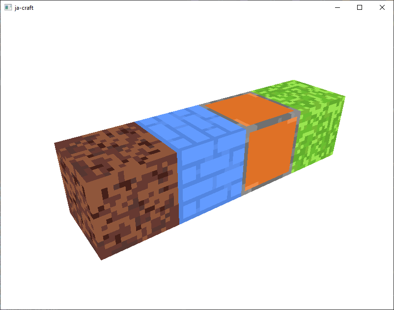
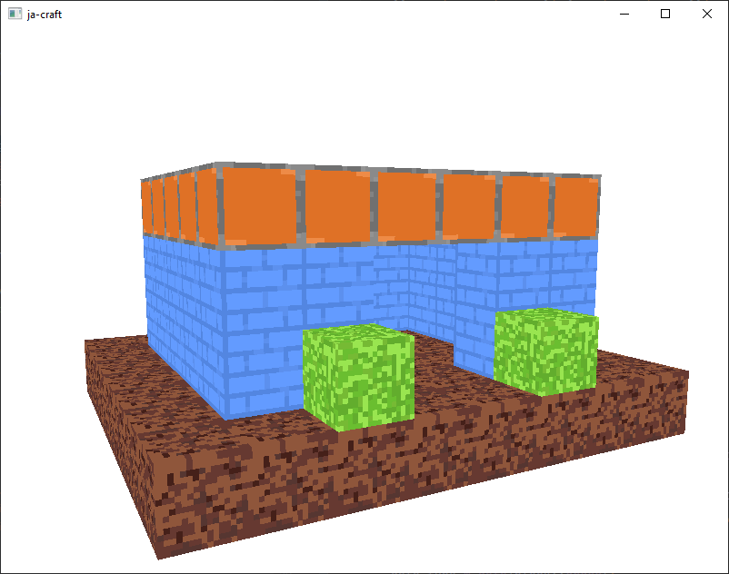

# Voxel Engine

A voxel engine written using C++26, GLFW, and OpenGL (using glad).

## Build Prerequisites

- GCC 14 or later.
- CMake 3.22 or later.
- Jinja2 >=2.7,<4.0

## How to Build

```sh
git clone https://github.com/jochemarends/voxel-engine.git
cd voxel-engine
mkdir build && cd build
cmake ..
cmake --build .
```

## Screenshots

Below are images from the previous version of this project:




